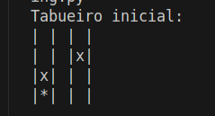
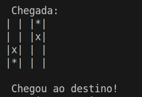
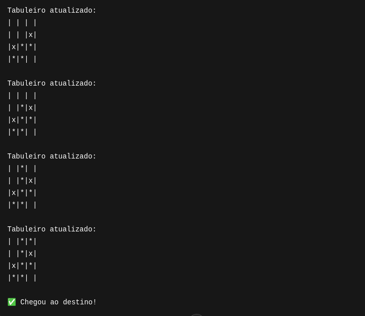

# 🧠 Algoritmo de Backtracking em Python

Este projeto implementa um algoritmo de **backtracking** para encontrar o caminho até um destino dentro de um tabuleiro 2D, onde existem posições livres e bloqueadas.

## 🚀 Objetivo

Partindo de uma posição inicial no tabuleiro, o algoritmo busca o caminho mais curto (em profundidade) até a posição de destino, evitando obstáculos e marcações inválidas.

## 📌 Regras do Tabuleiro

- O tabuleiro é representado por uma **matriz de strings**, onde:
  - `" "` representa uma posição livre.
  - `"x"` representa uma posição bloqueada.
  - `"*"` representa uma posição já visitada pelo algoritmo.
- O objetivo é chegar à **posição (0, 2)**.
- O movimento pode ser feito para cima, baixo, esquerda e direita (sem diagonais).

### Exemplo de Tabuleiro Inicial



### Exemplo de Tabuleiro Final



## 🧩 Algoritmo

O algoritmo de backtracking:

1. Começa na posição inicial `(3, 0)`.
2. Tenta mover-se recursivamente em todas as direções válidas.
3. Marca as posições visitadas com `"*"`.
4. Desfaz o movimento se não levar ao objetivo (backtrack).
5. Encerra quando alcança a posição `(0, 2)` ou quando não há caminho possível.


## ▶️ Como Executar

1. Clone este repositório e entre nele utilizando o comando cd:
```bash
   git clone https://github.com/seu-usuario/backtracking-algorithm.git

   cd backtracking-algorithm

```

2. Execute o arquivo:
```bash
python3 backtracking.py
```

### 💡 Exemplos de Saída



### 👩‍💻 Desenvolvido por


#### Carolina Mendes - Web Developer

[](https://www.linkedin.com/in/dev-carolina-mendes/)